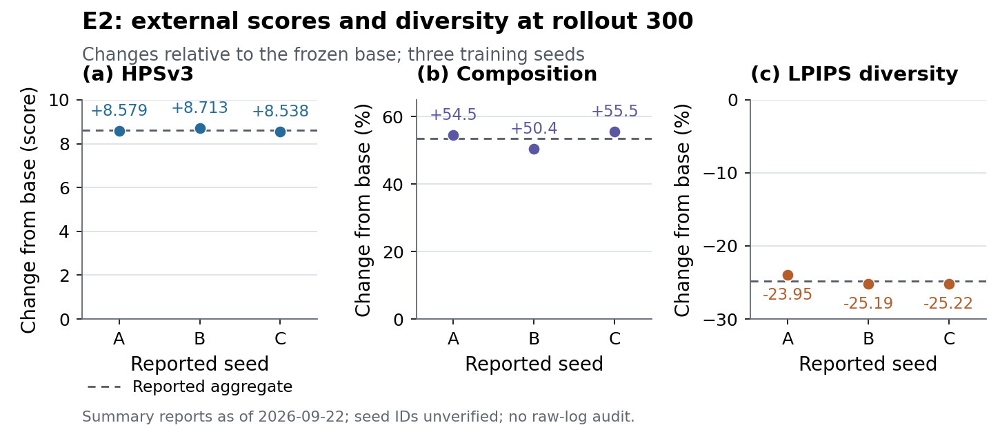
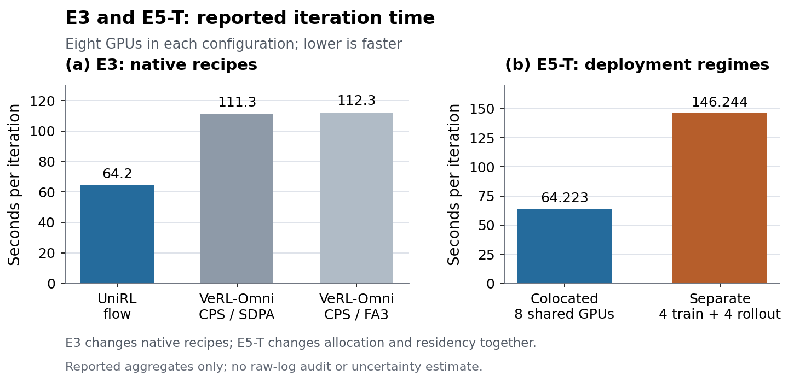

# Reported experiment summaries, as of 2026-09-22

This bundle records the experiment report retrieved on **2026-09-27**, whose own
status date is **2026-09-22**, together with the more precise values in the
[PR #2 manuscript at `ecce5097`](https://github.com/haonan3/UniRLReport/blob/ecce5097fa88a2ca336cf39c13e3cfd940e8c1ef/main.tex).
The live [Notion report](https://app.notion.com/p/UniRL-Experiment-Report-3e324a4934c8816c841ecdbc58d616ff)
is archived as plain text in `sources/notion-report.txt`; `sources/pr2-main.tex`
preserves the precision source. Snapshot hashes are in `manifest.json` and
`checksums.sha256`.

**Evidence tier: reported summaries, not independently verified raw experiments.**
The underlying experiment repositories were inaccessible during this review.
These files preserve what was reported and make the manuscript presentation
reproducible; they do not establish that a run was reproduced or that its logs,
checkpoints, evaluation settings, or claimed checksum checks were audited.
The archived PR manuscript also contains incomplete or conflicting statements;
archiving it does not endorse those statements.

## Files and manuscript integration

- `evidence.json`: manually transcribed values, comparison definitions, source
  identifiers, and limitations. This is the sole numeric input.
- `reported_values.csv`: generated long-form transcription of the same values.
  `reported_seed_A/B/C` preserve list order, not verified numeric seed IDs.
- `macros.tex`: generated numerical commands used by manuscript prose.
- `e2_table.tex`: table body for diffusion endpoints, distinguishing score
  differences from percentage changes relative to base. `--` means that the
  corresponding quantity was not transcribed from the available source.
- `systems_table.tex`: table body separating E3 recipe comparisons from E5-T
  deployment comparisons. Reported throughput is retained as reported.
- `figures/e2_quality_diversity.pdf`: three panels with the reported per-seed
  HPSv3, composition, and LPIPS changes at rollout 300 versus the frozen base.
- `figures/e3_e5_systems.pdf`: separate panels for the E3 and E5-T reported
  iteration-time aggregates. All configurations allocate eight GPUs in total.
- Matching PNG files allow GitHub previews. PDFs are the manuscript assets.
- `manifest.json` and `checksums.sha256`: source/artifact hashes and generator
  version information. Their hashes validate this bundle, not the original runs.

The committed TeX and PDF files work directly in Overleaf. Python and shell
escape are not required during LaTeX compilation. `main.tex` owns the floats,
captions, and labels; the table snippets require `tabularx` and `booktabs`.

```tex
\input{artifacts/reported_results/2026-09-22/macros.tex}
% Inside the relevant table/figure environments:
\input{artifacts/reported_results/2026-09-22/e2_table.tex}
\input{artifacts/reported_results/2026-09-22/systems_table.tex}
\includegraphics[width=\textwidth]{artifacts/reported_results/2026-09-22/figures/e2_quality_diversity.pdf}
\includegraphics[width=\textwidth]{artifacts/reported_results/2026-09-22/figures/e3_e5_systems.pdf}
```

## Interpretation boundaries

**E2:** the final checkpoint is rollout 300, compared with the frozen base.
Three seed changes are shown for HPSv3, composition, and diversity. Only aggregate
differences are available here for ImageReward and PickScore. The dashed lines
preserve the reported aggregate values; they are not recalculated from rounded
seed values. Composition's `+53.5%` is a relative change, not 53.5 percentage
points. LPIPS declines by `24.79%`; this is a reduction in within-prompt image
diversity, and accompanies the external-score improvement. The rollout-50
LPIPS values are preserved in JSON/CSV but are not used to fabricate a curve.

**E3:** `64.22`, `111.33`, and `112.26` seconds are the manuscript table's
reported aggregates. The table and figure display them at the Notion report's
one-decimal precision (`64.2`, `111.3`, `112.3`); the JSON/CSV retain the supplied
precision, which is not a claim of verified measurement accuracy.
The source materials disagree about replicate medians;
therefore this bundle does not reconstruct run statistics, error bars,
confidence intervals, or a statistical tie between SDPA and FA3. The native
recipes differ in estimator and LoRA target count; reward-service placement
remains unaudited.
The ratios `111.33 / 64.22 = 1.73` and `112.26 / 64.22 = 1.75` (rounded) describe
these reported recipe timings, not isolated framework overhead or
time-to-quality. The stated parameter-matched `1.70` ratio is excluded because
a directly measured control could not be verified.

**E5-T:** `146.244 / 64.223 = 2.277` (rounded) compares separate 4+4 GPUs with
colocated eight GPUs. The extra decimal precision is retained from its own
source paragraph. Allocation, training parallelism, residency, and publication
change together. It cannot measure representation cost (E5-R), isolate
communication overhead, or support a reward-phase attribution without the phase
records. No phase stack is fabricated.

**Exploratory prose macros:** E1's internal AIME values, E4a's synthetic check
count, and E6's failed quality pilot are included for traceable prose only; they
are not presented as completed external AR evaluation, recorded-rollout
correctness, or evidence for an asynchronous time-to-quality benefit. E6's
scorer/protocol audit remains pending.

## Regeneration

From the repository root, with the dependencies in
`experiments/reported_results/requirements.txt`:

```sh
python3 experiments/reported_results/generate.py
python3 experiments/reported_results/generate.py --check
```

The generator fixes plot styling, uses vector PDFs with embedded fonts, and
omits PDF timestamps. Repeated generation with the recorded Python, Matplotlib,
and NumPy versions produces byte-identical figure and table assets. Different
renderer versions can change binary hashes without changing the source data.
Update `evidence.json` and the source snapshots before regenerating if new
evidence arrives. Do not silently promote this evidence tier to a raw-log audit.




