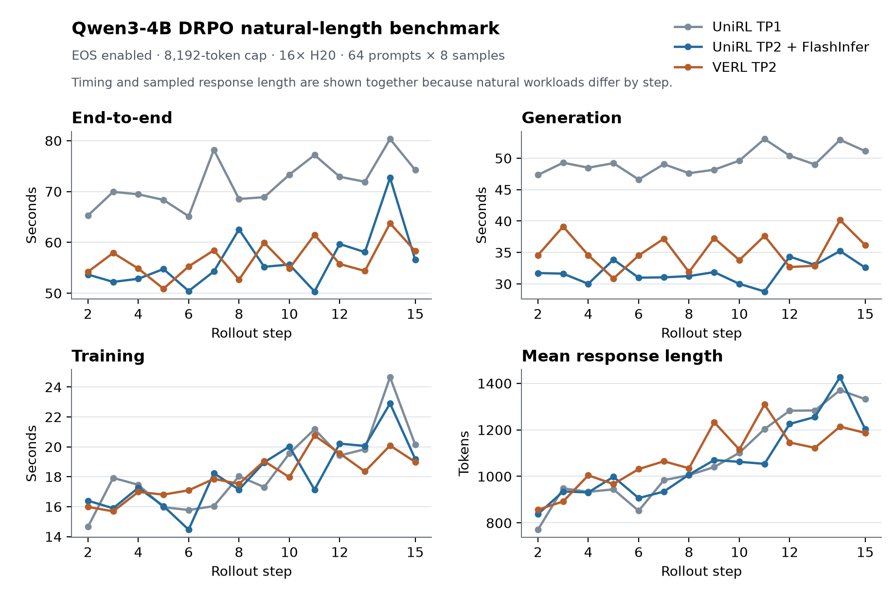

# Qwen3-4B DRPO: UniRL and VERL performance

This bundle reproduces the same Qwen3-4B DRPO recipe in UniRL and VERL. The
primary result uses naturally varying response lengths with EOS enabled and an
8,192-token cap. An exact 4,096-token workload is retained as a controlled
throughput check.

## Setup

| Setting | Value |
|---|---|
| Hardware | 2 nodes × 8 NVIDIA H20 96GB |
| Model | Qwen3-4B-Base |
| Data | DAPO-Math-17k, 17,917 prompts |
| Algorithm | DRPO / `spo_adaptive_eps` |
| Rollout | 64 prompts × 8 samples = 512 responses per step |
| Sampling | temperature 1.0, top-p 1.0, top-k disabled |
| Optimizer work | Four updates per rollout, 10,240-token budget per GPU |
| Natural workload | EOS enabled, 8,192-token cap, steps 2–15 measured |
| Fixed control | EOS ignored, exactly 4,096 tokens, steps 2–5 measured |
| Statistics | Step 1 excluded as warm-up; population standard deviation |

Both frameworks' final runs start from the same base weights and use the same
prompt order, tokenizer, loss, optimizer, precision, and batch configuration.
Natural sampling is stochastic, so the table reports response length and
output-token throughput alongside wall-clock time.

## Recipes

- [UniRL natural-length recipe](unirl_natural_recipe.yaml): eight SGLang TP2
  engines, HTTP backend, concurrency 64, Triton prefill, and FlashInfer decode.
- [UniRL TP1 diagnostic recipe](unirl_natural_tp1_recipe.yaml): the initial
  one-engine-per-GPU configuration used to isolate long-response latency.
- [VERL natural-length recipe](verl_natural_recipe.yaml): resolved Hydra job
  with eight asynchronous vLLM TP2 engines.
- Fixed-workload snapshots: [UniRL](unirl_recipe.yaml) and
  [VERL](verl_recipe.yaml).

Replace the `/path/to/...` entries in the VERL snapshots and set the documented
environment variables in the UniRL snapshots to local model and dataset paths.

## Natural-length result

The plot is generated directly from
[`natural_curve.csv`](natural_curve.csv):



Regenerate it with:

```bash
python3 artifacts/reported_results/2026-09-30-qwen3-4b-drpo/plot_natural.py
```

| Framework | End-to-end (s) | Generation (s) | Training (s) | Mean response | End-to-end output tok/s | Generation output tok/s |
|---|---:|---:|---:|---:|---:|---:|
| UniRL TP1 | 71.692 ± 4.466 | 49.420 ± 1.847 | 18.426 ± 2.524 | 1,075.1 | 7,678 | 11,138 |
| **UniRL TP2 + FlashInfer** | **56.351 ± 5.582** | **31.883 ± 1.722** | 18.138 ± 2.149 | 1,060.5 | 9,636 | **17,031** |
| VERL TP2 | 56.617 ± 3.400 | 35.240 ± 2.674 | **18.051 ± 1.450** | 1,084.1 | **9,804** | 15,751 |

The optimized UniRL and VERL runs are at end-to-end parity: UniRL is 0.5%
lower in raw step time while sampling responses that are 2.2% shorter. UniRL's
generation time is 9.5% lower and its generation output throughput is 8.1%
higher. Its end-to-end output throughput is 1.7% lower; this includes reward,
training, and weight synchronization rather than generation alone. Exact inputs
and relative differences are in
[`natural_performance.csv`](natural_performance.csv).

The initial TP1 topology is slow on the natural workload because every step
waits for the longest response, including traces that reach the 8,192-token
cap. Moving from sixteen TP1 engines to eight TP2 engines reduces that
long-tail decode latency. A short steps-2–5 check then found that switching TP2
decode from Triton to FlashInfer raised generation output throughput from
11,774 to 14,933 tok/s (+26.8%) and reduced end-to-end time from 62.078 to
51.975 seconds (-16.3%).

The fourteenth measured UniRL step contains a 10.607-second reward phase and is
retained. This is why its end-to-end standard deviation is larger than its
generation or training deviation.

## Fixed 4,096-token control

The fixed control makes both systems generate exactly the same number of output
tokens. Its plot is generated from [`curve.csv`](curve.csv):


| Framework | End-to-end (s) | Generation (s) | Training (s) |
|---|---:|---:|---:|
| **UniRL TP1** | **96.674 ± 3.400** | **38.105 ± 0.827** | **52.836 ± 1.271** |
| VERL TP2 | 106.292 ± 0.243 | 48.274 ± 0.133 | 54.785 ± 0.278 |

On this fixed workload, UniRL is 9.0% faster end to end. This result is a
controlled systems-throughput check, not a substitute for the natural-length
comparison above. Aggregate inputs are in
[`performance.csv`](performance.csv), and the plot regenerates with
[`plot.py`](plot.py).

The fourth measured UniRL control step includes a 10.478-second reward phase;
it is retained in the mean.

## Sources and scope

- Natural UniRL TP2 + FlashInfer W&B run:
  [`2evxz32k`](https://wandb.ai/leviking98z-zhejiang-university/unirl-grpo/runs/2evxz32k)
- Natural UniRL TP1 diagnostic W&B run:
  [`v48s5nb1`](https://wandb.ai/leviking98z-zhejiang-university/unirl-grpo/runs/v48s5nb1)
- Natural VERL TP2 W&B run:
  [`3q35u7qp`](https://wandb.ai/leviking98z-zhejiang-university/unirl-grpo/runs/3q35u7qp)
- UniRL TP2 Triton control W&B run:
  [`a9p95veq`](https://wandb.ai/leviking98z-zhejiang-university/unirl-grpo/runs/a9p95veq)
- UniRL TP2 FlashInfer short A/B W&B run:
  [`fyav21rl`](https://wandb.ai/leviking98z-zhejiang-university/unirl-grpo/runs/fyav21rl)
- Fixed UniRL and VERL W&B runs:
  [`qgl8dnkl`](https://wandb.ai/leviking98z-zhejiang-university/unirl-grpo/runs/qgl8dnkl) and
  [`yvybir9t`](https://wandb.ai/leviking98z-zhejiang-university/unirl-grpo/runs/yvybir9t)
- UniRL source commit: `095b76979847ed32f565be3c8deedec2016eb0dd`, including
  the performance recipe from
  [upstream PR #535](https://github.com/Tencent-Hunyuan/UniRL/pull/535)
- VERL reference source: `MaxwellJryao/SPO-DPPO@43803a66`; benchmark
  compatibility commit: `b170d4a6`
- Source JSONL SHA-256:
  `fcc950774dbb5bf4c249f90bf2e2517676619e798f5a921190cf1391fc5f922c`
- Converted parquet SHA-256:
  `d983528460e09ba7e98d589f6f72d920d2661debcdf69bce996492fa23f5a131`

These short runs support an end-to-end systems-performance comparison. They do
not establish time-to-quality or converged training quality.
