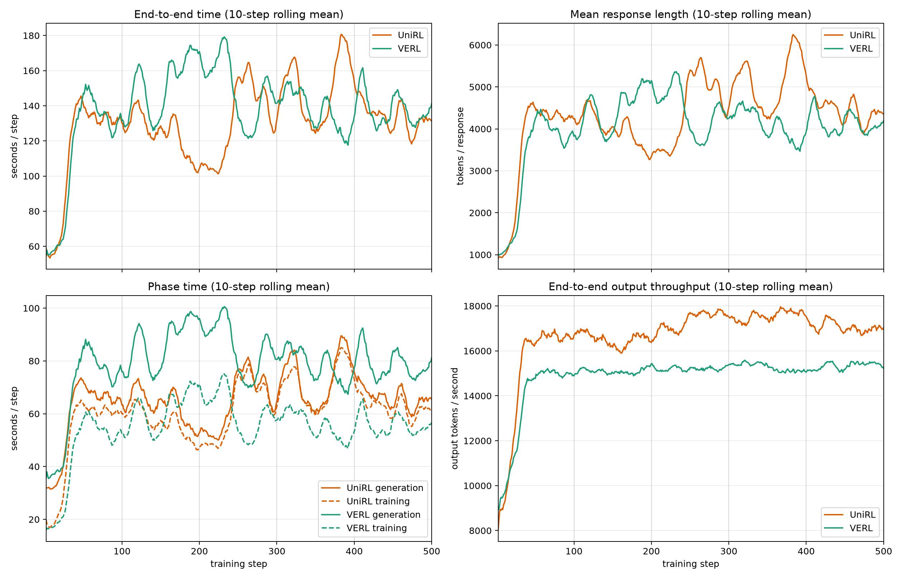

# Qwen3-4B DRPO: UniRL and VERL performance

This bundle reproduces a matched 500-step Qwen3-4B DRPO workload in UniRL and
VERL. The primary experiment uses naturally varying response lengths, EOS
enabled, and an 8,192-token response cap.

## Recipe

| Setting | Value |
|---|---|
| Hardware | 2 nodes × 8 NVIDIA H20 96GB per framework |
| Model | Qwen3-4B-Base |
| Data | DAPO-Math-17k, 17,917 prompts |
| Algorithm | DRPO / `spo_adaptive_eps` |
| Rollout batch | 64 prompts × 8 samples = 512 responses |
| Sampling | temperature 1.0, top-p 1.0, top-k disabled, EOS enabled |
| Response cap | 8,192 tokens |
| Optimizer work | Four updates per rollout, 10,240-token budget per GPU |
| Measured window | Steps 2–500; step 1 excluded as startup warm-up |

- [UniRL recipe](unirl_natural_recipe.yaml): eight SGLang TP2 engines, HTTP
  backend, concurrency 64, Triton prefill, and FlashInfer decode.
- [VERL recipe](verl_natural_recipe.yaml): eight asynchronous vLLM TP2 engines.

Both runs start from the same base weights and match prompt order, tokenizer,
loss, optimizer, precision, rollout batch, and update count. Natural sampling
is stochastic, so response length and token-normalized throughput are reported
alongside wall-clock time. UniRL used two nodes in one allocation; VERL used two
same-site nodes in separate allocations, so very small raw-time differences
should be read together with the token-normalized rates.

## Curve and raw data

[`natural_long_per_step.csv`](natural_long_per_step.csv) contains 499 measured
steps for each framework. The plotted values use a 10-step rolling mean.



Regenerate the PNG with:

```bash
python3 artifacts/reported_results/2026-09-30-qwen3-4b-drpo/plot_long_natural.py \
  artifacts/reported_results/2026-09-30-qwen3-4b-drpo/natural_long_per_step.csv \
  artifacts/reported_results/2026-09-30-qwen3-4b-drpo/natural_long_curves.png
```

Additional tables:

- [phase timing by 100-step band](natural_long_by_phase.csv)
- [framework comparison by band and overall](natural_long_comparison.csv)

With W&B credentials configured, regenerate all three CSV files with:

```bash
python3 artifacts/reported_results/2026-09-30-qwen3-4b-drpo/export_long_natural.py \
  --unirl-run 6jlpkjdr --verl-run xd9cv7e4 \
  --verl-log artifacts/reported_results/2026-09-30-qwen3-4b-drpo/verl_steps_499_500.txt \
  --output-dir artifacts/reported_results/2026-09-30-qwen3-4b-drpo \
  --max-step 500
```

## Final performance

Mean ± population standard deviation over steps 2–500:

| Framework | E2E s/step | Generation s/step | Training s/step | Mean response | E2E output tok/s | Generation output tok/s |
|---|---:|---:|---:|---:|---:|---:|
| **UniRL** | **131.279 ± 23.564** | **65.521 ± 11.374** | 60.852 ± 12.381 | 4,339.6 ± 942.1 | **16,925** | **33,911** |
| VERL | 138.628 ± 24.347 | 79.554 ± 13.221 | **55.679 ± 11.211** | 4,082.3 ± 821.8 | 15,077 | 26,273 |

Across the complete run, UniRL is 5.3% faster in raw end-to-end step time while
sampling responses that are 6.3% longer. Its end-to-end output-token throughput
is 12.3% higher and generation output-token throughput is 29.1% higher. VERL's
training phase is faster, but UniRL's generation advantage is larger at this
workload.

| Step band | VERL s/step (resp.) | UniRL s/step (resp.) | UniRL raw E2E | UniRL E2E tok/s | UniRL generation tok/s |
|---|---:|---:|---:|---:|---:|
| 0–100 | 115.84 (3,240) | 117.03 (3,626) | 1.0% slower | 10.8% higher | 27.2% higher |
| 100–200 | 153.35 (4,530) | 123.44 (3,976) | 19.5% faster | 9.1% higher | 22.9% higher |
| 200–300 | 148.25 (4,403) | 132.25 (4,500) | 10.8% faster | 14.6% higher | 32.6% higher |
| 300–400 | 137.23 (4,092) | 150.45 (5,156) | 9.6% slower | 14.9% higher | 33.4% higher |
| 400–500 | 138.24 (4,139) | 133.09 (4,433) | 3.7% faster | 11.2% higher | 28.5% higher |

The raw E2E ordering changes with the sampled length distribution; output-token
throughput is consistently higher for UniRL in every band.

## Provenance

- UniRL W&B run:
  [`6jlpkjdr`](https://wandb.ai/leviking98z-zhejiang-university/unirl-grpo/runs/6jlpkjdr)
- VERL W&B run:
  [`xd9cv7e4`](https://wandb.ai/leviking98z-zhejiang-university/unirl-grpo/runs/xd9cv7e4)
- UniRL source commit: `6148a5d492bbe7dad32ca761a2de6d16a72bf067`,
  included in merged [UniRL PR #535](https://github.com/Tencent-Hunyuan/UniRL/pull/535)
- VERL reference source: `MaxwellJryao/SPO-DPPO@43803a66`; benchmark
  compatibility commit: `b170d4a6`

W&B contains UniRL steps 2–500 and VERL steps 2–498. VERL steps 499–500 were
completed and printed by the trainer but were not flushed to W&B during final
shutdown; the exporter supplements only those missing rows from the committed
[`verl_steps_499_500.txt`](verl_steps_499_500.txt) excerpt.

The earlier short natural-length diagnostics and exact 4,096-token control are
retained in this directory. The fixed control inputs and outputs are
[`unirl_recipe.yaml`](unirl_recipe.yaml), [`verl_recipe.yaml`](verl_recipe.yaml),
[`curve.csv`](curve.csv), [`curve.png`](curve.png), and
[`performance.csv`](performance.csv).
