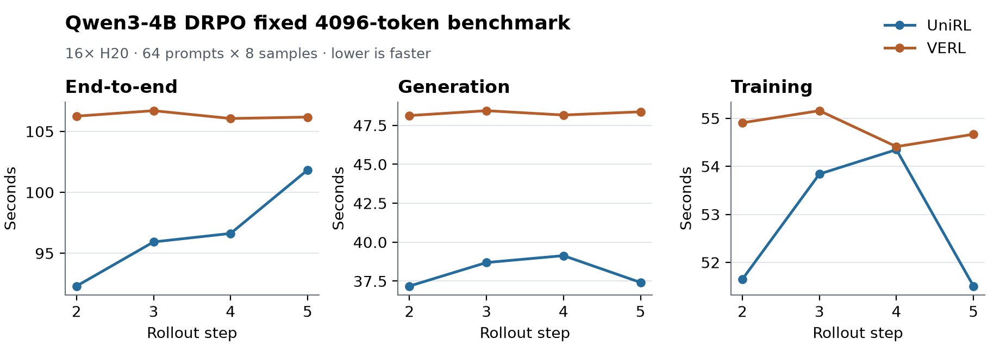

# Qwen3-4B DRPO: UniRL and VERL performance

This bundle records a controlled end-to-end comparison of UniRL and VERL on
Qwen3-4B-Base. The current result fixes every response at 4,096 tokens so both
systems execute exactly the same generation workload. A natural-length follow-up
will be added to this bundle separately; the fixed-length result should not be
read as a complete model of production response-length variation.

## Setup

| Setting | Value |
|---|---|
| Hardware | 2 nodes × 8 NVIDIA H20 96GB |
| Model | Qwen3-4B-Base |
| Data | DAPO-Math-17k, 17,917 prompts |
| Algorithm | DRPO / `spo_adaptive_eps` |
| Rollout | 64 prompts × 8 samples = 512 responses |
| Response workload | `ignore_eos=true`, exactly 4,096 tokens per response |
| Optimizer work | Four updates per rollout |
| Statistics | Rollout steps 2–5; step 1 excluded as warm-up; population standard deviation |

The model, dataset contents, tokenizer, sampling parameters, token budget,
log-probability precision, loss aggregation, and optimizer-update count were
audited before launch. UniRL uses its native SGLang TP1 backend; VERL uses its
native asynchronous vLLM TP2 backend.

## Recipes

- [UniRL recipe](unirl_recipe.yaml): runnable snapshot of the
  [source YAML at `095b769`](https://github.com/leviking98z-rgb/UniRL/blob/095b76979847ed32f565be3c8deedec2016eb0dd/examples/ar/qwen3_drpo_4b_base_dapo_sglang.yaml),
  including the benchmark overrides from
  [upstream PR #535](https://github.com/Tencent-Hunyuan/UniRL/pull/535).
- [VERL recipe](verl_recipe.yaml): resolved Hydra job used for the comparison.
  Replace the two `/path/to/...` entries with the local model and converted
  DAPO parquet paths.

The UniRL performance changes are:

- admit all 32 sequences assigned to each TP1 engine in one rollout wave;
- capture decode CUDA graphs through batch size 32 instead of falling back to
  eager execution at that batch size;
- use SGLang's native grouped sampling path for this reference performance
  recipe;
- retain an optional faster deterministic sampler for strict rollout/replay
  diagnostics.

## Per-step curve

The plot is generated directly from
[`curve.csv`](curve.csv):



Regenerate it with:

```bash
python3 artifacts/reported_results/2026-09-30-qwen3-4b-drpo/plot.py
```

## Final comparison

| Framework | End-to-end (s) | Generation (s) | Training (s) |
|---|---:|---:|---:|
| **UniRL** | **96.674 ± 3.400** | **38.105 ± 0.827** | **52.836 ± 1.271** |
| VERL | 106.292 ± 0.243 | 48.274 ± 0.133 | 54.785 ± 0.278 |

For this fixed-length workload, UniRL is **9.0% faster end to end**, with
**21.1% lower generation time** and **3.6% lower training time**.

The fourth measured UniRL step includes a 10.478-second reward phase, versus
0.713–1.043 seconds for the other three steps. It is retained in the reported
mean rather than removed as an outlier. The exact aggregate inputs are in
[`performance.csv`](performance.csv).

## Sources and scope

- UniRL W&B run: [`qgl8dnkl`](https://wandb.ai/leviking98z-zhejiang-university/unirl-grpo/runs/qgl8dnkl)
- VERL W&B run: [`yvybir9t`](https://wandb.ai/leviking98z-zhejiang-university/unirl-grpo/runs/yvybir9t)
- UniRL source commit: `095b76979847ed32f565be3c8deedec2016eb0dd`
- VERL reference source: `MaxwellJryao/SPO-DPPO@43803a66`; benchmark compatibility commit: `b170d4a6`
- Source JSONL SHA-256: `fcc950774dbb5bf4c249f90bf2e2517676619e798f5a921190cf1391fc5f922c`
- Converted parquet SHA-256: `d983528460e09ba7e98d589f6f72d920d2661debcdf69bce996492fa23f5a131`

This bundle supports a fixed-workload systems-throughput claim. It does not yet
support a claim about natural-length training throughput or time to quality.
