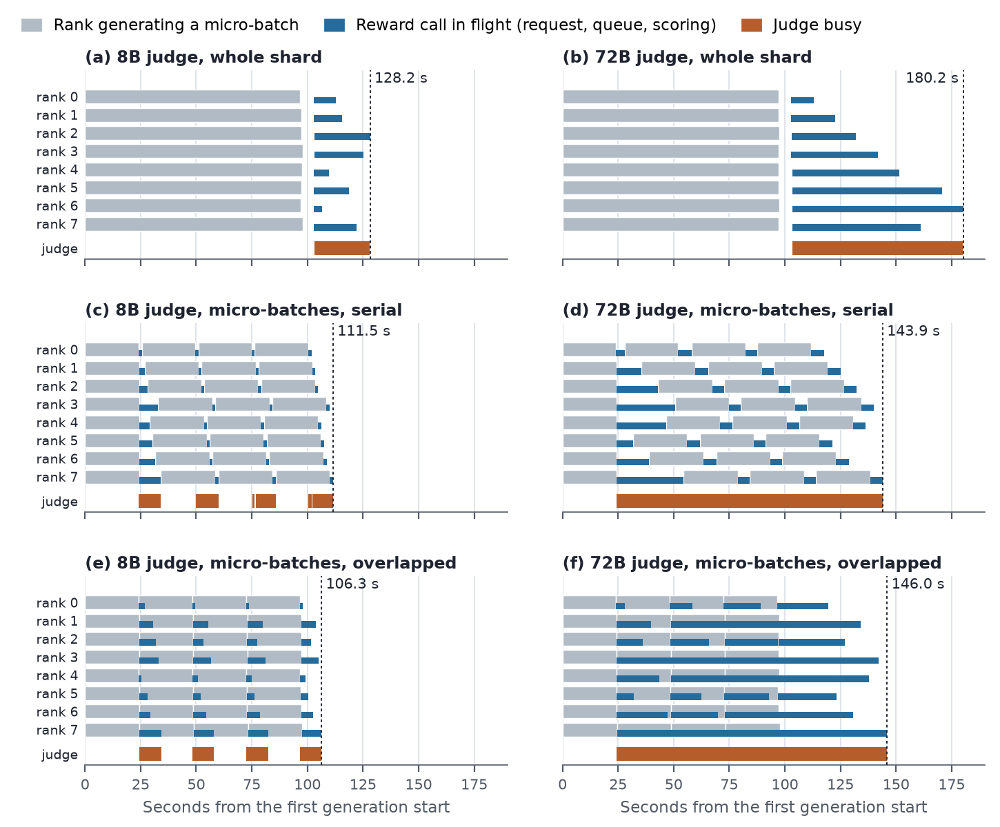
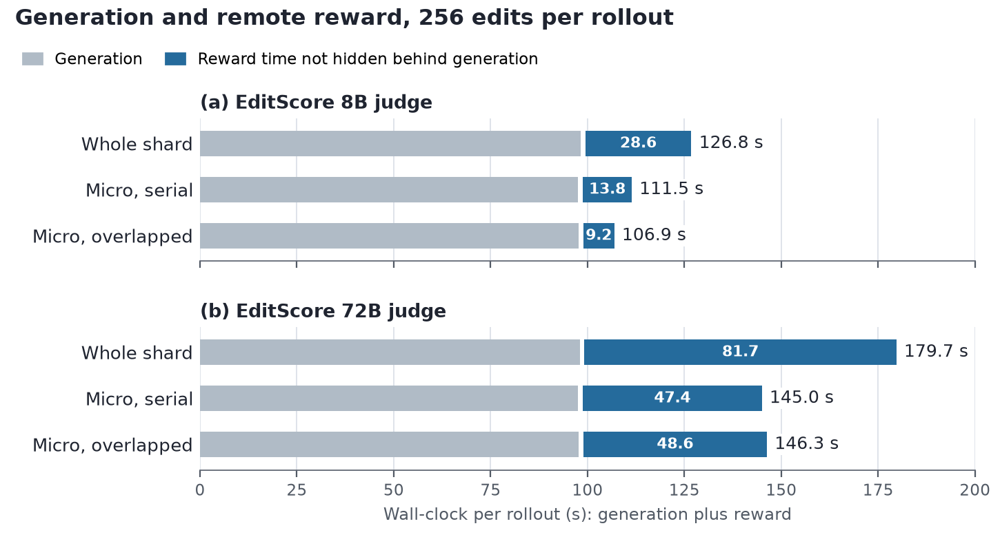

# Reward service: scorers, deployment, generation–reward overlap, MPS

This bundle backs the manuscript section `sections/reward_service.tex`
("Reward Serving and Generation–Reward Overlap"). It has three parts with three
different evidence tiers:

| Part | What it is | Evidence tier |
|---|---|---|
| Scorer inventory (`scorers.csv`) | which reward implementations exist and where they run | read from source at UniRL `651490e` (2026-09-30); presence of a code path, not a training result |
| Generation–reward overlap (`overlap_runs.csv`, `overlap_trace.csv`) | per-rollout phase timings of the micro-batch reward schedule, and per-rank / judge-side event traces of the traced runs | measured by us on H20 nodes; extracted from the run logs |
| MPS sharing (`mps_reported.csv`) | throughput of small scorers sharing one GPU | **transcribed** from the body of the open UniRL pull request #492 (head `8bb4119`, text as of 2026-09-28); not re-measured by us |

Code references: [UniRL #445](https://github.com/Tencent-Hunyuan/UniRL/pull/445)
(micro-batch reward schedule, merged as `651490e`),
[#303](https://github.com/Tencent-Hunyuan/UniRL/pull/303) and
[#348](https://github.com/Tencent-Hunyuan/UniRL/pull/348) (managed scorer child, EditScore),
[#428](https://github.com/Tencent-Hunyuan/UniRL/pull/428) (per-role residency),
[#134](https://github.com/Tencent-Hunyuan/UniRL/pull/134) (reward slab),
[#492](https://github.com/Tencent-Hunyuan/UniRL/pull/492) and RFC
[#463](https://github.com/Tencent-Hunyuan/UniRL/issues/463) (MPS, open).

## Generation–reward overlap

### Setup

| Setting | Value |
|---|---|
| Training node | one node, 8 × NVIDIA H20 96 GB; two separate 4 × 8 allocations (`A`, `B`) were used across sessions |
| Editing workload | BAGEL-7B-MoT image editing (`bagel_it2i`), LoRA rank 64, vLLM-Omni rollout with 8 data-parallel engines, 512² sources |
| Rollout | 32 prompts × 8 edits = 256 rows, 32 rows per rank; a secondary shape uses 16 prompts (16 rows per rank) |
| Remote judge | EditScore served by `reward_service.direct_server` on another node over HTTP, one vLLM engine: 8B (Qwen3-VL-8B base, TP 8 on allocation A / TP 4 on B) and 72B (Qwen2.5-VL-72B base, TP 8) |
| In-process control | BAGEL-7B-MoT text-to-image (`bagel_t2i`) with PickScore in the policy's workers |
| Schedules | `baseline`: whole shard, then the driver-dispatched reward phase; `serial`: `reward_stack` with `overlap: false`; `overlap`: `overlap: true`; `request_batch_only`: baseline with `request_batch_size: 8` and no stack |
| Micro-batch | 8 rows (4 per rank and rollout) unless stated |
| Statistics | runs of 2–3 rollouts; rollout 1 is excluded as warm-up; steady-state rollouts are pooled across sessions; mean with min–max |
| Timers | the driver's phase timers (`generate` + `reward` for the baseline, `rollout_score` under the stack) |

### Result

Recorded rollouts (second rollout of one traced run per panel; rows are the eight
ranks and the judge):



Pooled means:



Generation plus reward per rollout, seconds (`overlap_summary.csv`):

| Reward | Rows/rank | Micros/rank | Schedule | Rollouts / sessions | Mean | Range | Generation | Reward outside generation | vs. baseline |
|---|---:|---:|---|---:|---:|---|---:|---:|---:|
| EditScore 8B, remote | 32 | – | baseline | 4 / 3 | 126.8 | 125.9–127.8 | 98.2 | 28.6 | – |
| | 32 | 4 | serial | 5 / 4 | 111.5 | 110.9–111.9 | 97.6 | 13.8 | −12.1% |
| | 32 | 4 | overlap, both implementations | 7 / 5 | 106.9 | 106.6–107.3 | 97.7 | 9.2 | −15.7% |
| | 32 | 4 | – merged (queued) | 2 / 1 | 106.8 | 106.8–106.8 | 97.6 | 9.1 | −15.8% |
| | 32 | 4 | – depth-1 prototype | 5 / 4 | 106.9 | 106.6–107.3 | 97.8 | 9.2 | −15.7% |
| | 32 | 8 | serial | 1 / 1 | 113.0 | – | 97.8 | 15.1 | −10.9% |
| | 32 | 8 | overlap, merged (queued) | 1 / 1 | 104.8 | – | 97.9 | 6.9 | −17.4% |
| EditScore 72B, remote | 32 | – | baseline | 2 / 2 | 179.7 | 179.2–180.1 | 98.0 | 81.7 | – |
| | 32 | 4 | serial | 4 / 3 | 145.0 | 144.4–146.0 | 97.6 | 47.4 | −19.3% |
| | 32 | 4 | overlap, both implementations | 6 / 4 | 146.3 | 144.3–149.1 | 97.7 | 48.6 | −18.6% |
| | 32 | 4 | – merged (queued) | 2 / 1 | 147.8 | 146.5–149.1 | 97.6 | 50.2 | −17.8% |
| | 32 | 4 | – depth-1 prototype | 4 / 3 | 145.5 | 144.3–147.2 | 97.7 | 47.8 | −19.0% |
| PickScore, in-process | 32 | – | baseline | 2 / 1 | 56.0 | 56.0–56.0 | 51.5 | 4.5 | – |
| | 32 | 4 | serial | 2 / 1 | 52.4 | 52.4–52.5 | 51.3 | 1.1 | −6.3% |
| | 32 | 4 | overlap, depth-1 prototype | 2 / 1 | 52.3 | 52.3–52.3 | 51.8 | 0.6 | −6.5% |

Secondary shape, 16 rows per rank (one steady-state rollout per arm):

| Reward | Baseline | 8-row requests, no stack | Serial, 2 micros | Overlap (depth-1), 2 micros |
|---|---:|---:|---:|---:|
| EditScore 8B | 64.6 | 69.6 (+7.7%) | 59.6 (−7.8%) | 58.5 (−9.4%) |
| EditScore 72B | 98.5 | 113.1 (+14.8%) | 86.9 (−11.8%) | 85.8 (−12.9%) |

What the numbers support:

- Cutting the shard into micro-batches removes 12% (8B) to 19% (72B) of
  generation plus reward. Generation itself stays at about 98 s; the saving is
  reward time that no longer sits after generation.
- Overlapping adds a further step only while the judge has headroom (8B:
  111.5 → 106.9 s). With the 72B judge it is indistinguishable from the serial
  schedule (146.3 s, range 144.3–149.1, against 145.0 s, range 144.4–146.0);
  see the judge-side view below for why.
- Smaller requests alone are not the mechanism: splitting the whole-shard
  request into 8-row requests without the stack is slower than the baseline on
  both judges.
- With a cheap in-process scorer the stack still saves 3.6 s per rollout. The
  in-worker scoring time is about 1 s; the remainder of the baseline's 4.5 s
  reward phase is the driver-dispatched call.

### Judge-side view (traced runs)

Thirteen runs logged per-rank events inside the workers and the arrival and
completion of every request at the judge's server (`overlap_trace.csv`, steady
rollouts only, rebased to the first generation start). Aggregates per schedule
(`overlap_judge_summary.csv`); overlap pools both implementations:

| Judge | Schedule | Rollouts | Requests × pairs | Service / request | Judge work / rollout | Judge idle between first and last request | First arrival | Longest wait, first micro | Median wait, later micros |
|---|---|---:|---|---:|---:|---:|---:|---:|---:|
| 8B | baseline | 3 | 8 × 32 | 3.08 s | 24.6 s | 0.0 s | 103.5 s | 24.6 s | – |
| 8B | serial | 3 | 32 × 8 | 1.20 s | 38.5 s | 48.3 s | 24.3 s | 9.6 s | 1.3 s |
| 8B | overlap | 5 | 32 × 8 | 1.18 s | 37.7 s | 44.3 s | 24.3 s | 9.5 s | 4.9 s |
| 72B | baseline | 1 | 8 × 32 | 9.61 s | 76.9 s | 0.0 s | 103.2 s | 76.6 s | – |
| 72B | serial | 3 | 32 × 8 | 3.76 s | 120.4 s (119.7–121.4) | 0.0 s | 24.3 s | 29.7 s | 5.8 s |
| 72B | overlap | 5 | 32 × 8 | 3.81 s | 121.8 s (119.5–124.5) | 0.0 s | 24.3 s | 30.5 s | 29.3 s |

What the traces show:

- Baseline: all eight requests arrive together about 5 s after generation ends
  and the server scores them one at a time, so the last rank waits for the
  other seven.
- Serial micro-batches: the ranks collide once, on the first micro-batch; the
  unequal waits stagger them, and later requests find the 8B judge free
  (median wait 1.3 s against a 1.2 s service time).
- Overlap: generation never waits, so the ranks stay in step and collide on
  every micro-batch, but the waiting runs beside the next generation.
- 72B: the judge has no idle time between the first arrival and its last
  request in either micro-batch schedule. The rollout ends at the first
  arrival plus the judge's total work, so the schedule cannot matter. The
  total work differs by 1–3 s between arms and drifts by 2–3 s between
  consecutive rollouts of one arm (serial 119.7 → 121.4, queued overlap
  121.7 → 124.5, depth-1 overlap 119.5 → 122.4 s); the higher pooled mean of
  the queued-overlap rollouts is that drift, not a cost of overlapping.
- Small requests cost the judge more in total: 120 s against 77 s per rollout
  for the 72B judge, 38 s against 25 s for the 8B judge. The schedule wins
  because that work starts 24 s into the rollout instead of after it.

### Train phase after a micro-batched rollout

Two sessions carried arms with a collection pass (`gc.collect` plus
`empty_cache`) at the rollout boundary (`flush_after_rollout = 1`). Mean train
phase over steady-state rollouts of the stack arms:

| Session | Without the pass | With the pass |
|---|---:|---:|
| EditScore 8B remote (`20260928-093100`) | 192.2 s | 178.1 s |
| PickScore in-process (`20260928-093606`) | 58.0 s | 54.5 s |

The merged role runs this pass once the shard has left the worker
(`RewardStack.collect_garbage`). The follow-up arms that attribute the effect
to Python garbage collection and not to the CUDA cache are described in the
UniRL reward README; they are not part of this bundle.

### Sessions

`overlap_runs.csv` has one row per arm and rollout. Sessions are keyed by their
launch stamp; node addresses and storage paths are not recorded here.

| Session | Alloc. | Revision | Reward | Rows/rank | Arms |
|---|---|---|---|---:|---|
| `20260922-163432` | A | `1fd8f59` | EditScore 8B, TP 8 | 16 | baseline, serial, overlap (depth-1), 8-row requests |
| `20260922-170146` | A | `1fd8f59` | EditScore 72B, TP 8 | 16 | baseline, serial, overlap (depth-1), 8-row requests |
| `20260922-175009` | A | `1fd8f59` | EditScore 8B, TP 8 | 32 | baseline, serial, overlap (depth-1) |
| `20260922-181520` | A | `1fd8f59` | EditScore 72B, TP 8 | 32 | baseline, serial, overlap (depth-1) |
| `20260922-190018` | A | `1fd8f59` | EditScore 8B, TP 8 | 32 | serial, overlap (depth-1) |
| `20260923-225836` | A | `97e83f6` | EditScore 8B, TP 8 | 32 | baseline, serial, overlap (depth-1) |
| `20260923-230352` | A | `97e83f6` | EditScore 72B, TP 8 | 32 | baseline, serial, overlap (depth-1) |
| `20260928-093100` | B | `97e83f6` | EditScore 8B, TP 4 | 32 | baseline, serial, overlap (depth-1), each stack arm also with the collection pass |
| `20260928-093606` | B | `97e83f6` | PickScore in-process | 32 | baseline, serial, overlap (depth-1), overlap with the collection pass |
| `20260928-114630` | B | `1163848` | EditScore 72B, TP 8 | 32 | serial, overlap (queued) |
| `20260928-124606` | B | `97e83f6` | EditScore 72B, TP 8 | 32 | overlap (depth-1) |
| `20260928-131525` | B | `1163848` | EditScore 8B, TP 4 | 32 | overlap (queued) |
| `20260930-141053` | B | `fe57386` | EditScore 8B, TP 4 | 32 | serial and overlap (queued) at `micro_batch_size: 4` |

Revisions are pre-merge states of the #445 branch: `1fd8f59` is the branch
revision measured on 2026-09-22; `97e83f6` adds event-trace instrumentation to it;
`1163848` is the queued-overlap revision (`28a703d` on the PR branch) with the
same instrumentation; `fe57386` is the final tree before the squash merge
`651490e`. The instrumented revisions are not on the public branch.

### Limits

- Few rollouts per arm (1–5 steady-state rollouts) and no repeated seeds. The
  table supports the direction and rough size of the effect for this workload
  shape, not a distribution or a confidence interval.
- One policy (BAGEL) and one judge family (EditScore) for the remote case.
- Sessions are pooled across two allocations of the same hardware, two judge
  tensor-parallel sizes for the 8B judge, and revisions with and without trace
  instrumentation. `overlap_runs.csv` keeps them apart.
- The merged (queued) overlap was measured in fewer sessions than the depth-1
  prototype, which kept at most one score in flight. The manuscript table pools
  the two; `overlap_summary.csv` keeps them apart. For the in-process scorer
  only the prototype was measured.
- The timeline figure shows single rollouts. The 72B baseline panel comes from
  allocation A (2026-09-23); the other five panels from allocation B
  (2026-09-28). Its times count from the first generation start and, for the
  baseline, include the engine's sleep between generation and the reward
  phase, so they differ from the phase-timer sums of the same rollouts by up
  to about 1 s.
- Session `20260922-163432` ran with the evaluation pass enabled; its gate
  marked the arms failed because its expected request count did not include the
  evaluation requests. The processes exited 0 and the training-rollout timings
  are used.
- The UniRL reward README quotes single-session values (127.5 → 111.6 → 106.8 s
  for the 8B judge, 180.1 → 144.7 s for the 72B judge). They lie inside the
  pooled ranges above. It also quotes the PR author's SD3.5 trainside number
  (0.15 s of a 108.8 s step), which is a different workload and is not in this
  bundle.
- These are reward-path measurements. They do not revise E3 or E5-T.
- **Measured before UniRL #547.** On this path the BAGEL image-editing rollout
  did not inject its own source-image contexts, so generation carried the
  serving engine's more expensive prefix: 49.2 s against 36.8 s per rank for
  16 rows at the same shape. Reward cost is unaffected, so a corrected
  baseline spends relatively more of its rollout on reward than the tables
  above show, and the overlap they measure would matter more rather than
  less. See `../2026-10-04-rollout-fidelity/`. This study has not been re-run
  on the corrected path.

## MPS sharing (transcribed)

`mps_reported.csv` transcribes two tables from the body of UniRL #492: the
throughput gain of MPS at 100% active threads over fractional Ray placement
without MPS, on one H20 (driver 535.247.01, Ray 2.46.0), client concurrency 4.

Two or three copies of one scorer (`table = homogeneous`), gain in percent:

| Scorer | 2 copies, b=1 | b=4 | b=8 | 3 copies, b=1 | b=4 | b=8 |
|---|---:|---:|---:|---:|---:|---:|
| CLIP | +11.2 | +20.0 | +14.8 | +16.5 | +24.4 | +19.2 |
| HPSv2 | +17.4 | – | – | +48.4 | – | – |
| ImageReward | +24.0 | – | – | +40.8 | – | – |
| HPSv3 | +20.6 | +11.2 | – | +22.6 | +12.8 | – |
| GOT-OCR | −2.8 | – | – | −3.2 | – | – |

Panels of different scorers (`table = mixed`), median gain at service batch 1:
three light rewards +24.9% (4 combinations), two light rewards +9.6% (6),
pairs with HPSv3 +4.8% (4), triples with HPSv3 +6.9% (6), combinations with
GOT-OCR about 0% (15).

Points the manuscript relies on, all from the pull request and its review
thread, none re-measured here:

- scores were identical with and without MPS on the PR's deterministic fixture;
- below 100% active threads, float16/bfloat16 matrix products were wrong on the
  tested H20 driver stack, so the runtime rejects half-precision scorers below
  100%;
- a reviewer of the earlier #482 did not reproduce that failure on a different
  accelerator and driver, where the panel was CPU/HTTP-bound and co-location
  was nearly free without MPS;
- only CLIP + PickScore at 100% are qualified in the PR; vLLM scorers and soak
  runs are out of its scope;
- the throughput reported in the closed #482 was withdrawn by its author
  (measured before the node was idle) and is not transcribed.

The pull request is open. If it changes before merging, this file and the
manuscript subsection need to be refreshed.

## Scorer inventory

`scorers.csv` lists 20 in-process backends (`unirl/reward/local/`, one of them
an unimplemented placeholder that the manuscript table omits) and 13 scorers
registered in `unirl-reward-service`. `managed_child = yes` marks scorers whose
request type the rank-local managed child accepts (image and image-edit
histories); `offload = yes` marks scorers that can leave the GPU between calls.

## Files

- `overlap_runs.csv`: per-rollout phase timings, one row per arm and rollout.
- `extract_overlap_runs.py`: how `overlap_runs.csv` was produced from the gate
  status summaries. It needs the original summaries, which stay on the
  experiment storage with the raw logs.
- `overlap_trace.csv`: per-rank generation and reward-call intervals and
  judge-side request service intervals of the traced runs.
- `extract_overlap_trace.py`: how `overlap_trace.csv` was produced from the
  driver and judge-server logs (same storage as above).
- `overlap_summary.csv`, `overlap_judge_summary.csv`: aggregates (generated).
- `scorers.csv`, `mps_reported.csv`: hand-maintained inputs described above.
- `overlap_table.tex`, `scorers_table.tex`, `mps_table.tex`, `macros.tex`:
  generated table bodies and numeric macros used by `sections/reward_service.tex`.
- `figures/overlap_timeline.pdf` / `.png`, `figures/overlap_wallclock.pdf` /
  `.png`: generated figures; the PDFs are the manuscript assets.
- `generate.py`: regenerates every generated file from the four input CSVs.

```bash
python3 artifacts/reported_results/2026-09-30-reward-service/generate.py
# only with access to the original logs:
python3 extract_overlap_runs.py <log dir> overlap_runs.csv
python3 extract_overlap_trace.py <log dir> overlap_trace.csv
```

Validated with Python 3.11 and Matplotlib 3.11.1. The manuscript uses the
committed TeX and PDF files, so Overleaf needs no Python.
