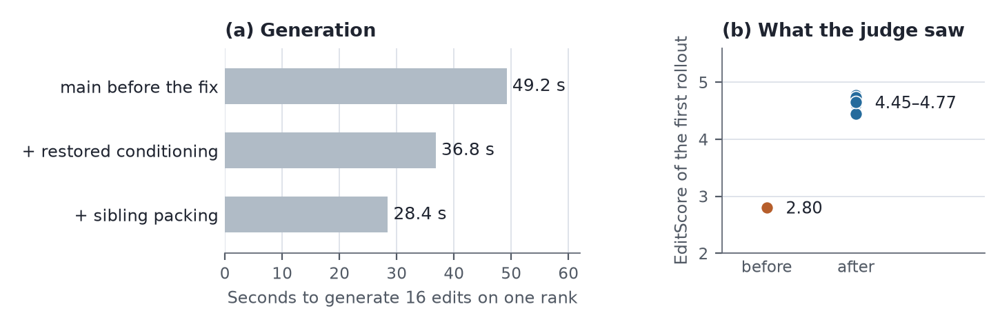

# Rollout fidelity and request shaping for BAGEL image editing

This bundle backs `sections/rollout_fidelity.tex`. It records four changes to the
vLLM-Omni BAGEL rollout path and what each one did to one image-editing workload,
plus a scheduling experiment that the per-group canvas made possible.

| Part | What it is | Evidence tier |
|---|---|---|
| The four changes (`it2i_arms.csv`, `layout_check.csv`, `canvas_cost.csv`) | per-arm timings, judge scores and layout probes | measured by us on H20 nodes; extracted from the gate logs |
| Mixed-canvas long tail (`mixed_canvas_tail.csv`) | slowest vs. mean rank generation under mixed canvases | measured by us, same runs |
| Cost-aware assignment (`longtail_arms.csv`) | what balancing and stealing recover | measured by us on a branch with **no pull request**; not proposed upstream |

Upstream pull requests, all open at the time of writing and stacked in this order:

| PR | Title | Head |
|---|---|---|
| [#547](https://github.com/Tencent-Hunyuan/UniRL/pull/547) | `fix(rollout): restore BAGEL it2i context injection on vLLM-Omni` | `cd7a772` |
| [#548](https://github.com/Tencent-Hunyuan/UniRL/pull/548) | `feat(train): BAGEL token-layout check and first-update ratio guard` | `2feff98` |
| [#549](https://github.com/Tencent-Hunyuan/UniRL/pull/549) | `feat(rollout): per-group canvas for vLLM-Omni BAGEL rollouts` | `32a897d` |
| [#550](https://github.com/Tencent-Hunyuan/UniRL/pull/550) | `feat(rollout): pack sibling runs for vLLM-Omni BAGEL it2i` | `61a39af` |

They come from a fork, so each targets `main` and shows the cumulative diff until
the ones below it land. #547 has to go first: once #548 is in, the mismatch #547
fixes becomes a hard failure on every image-editing recipe. All four are tracked
under [RFC #537](https://github.com/Tencent-Hunyuan/UniRL/issues/537).

## Setup

| Setting | Value |
|---|---|
| Hardware | one training node of 8 × NVIDIA H20 96 GB; the judge on a second node |
| Policy | BAGEL-7B-MoT, LoRA, FlowGRPO, 14 denoising steps, vLLM-Omni rollout with 8 data-parallel engines |
| Runtime | vllm 0.28.0 / vllm-omni 0.28.0 |
| Editing workload | `bagel_it2i_vllmomni`, 16 prompts × 8 samples = 128 rows, 16 rows per rank, 512² sources and outputs, EditScore-8B over HTTP |
| Text-to-image control | `bagel_t2i_residency_gate` with in-process PickScore |
| Mixed-canvas datasets | row canvases drawn per row and frozen in `metadata.canvas`; default (and upper bound) 1024², about a third at 512², a four-fold token span |
| Anchor | `old_logp_source=rollout` wherever a first-update ratio is reported, so the ratio compares the engine's log-probs with the trainer's |

## The four changes on one workload



`it2i_arms.csv`, one row per arm and rollout. Generation is the slowest rank's
seconds for its 16 rows; the reward column is the mean judge score of the **first**
rollout, which no optimizer step has yet influenced, on the same prompts.

| Rollout path | Commit | Rollouts | Generation | vs. main | First-rollout EditScore |
|---|---|---:|---:|---:|---:|
| `main` before the fix | `9e14d00` | 1 | 49.2 s | – | 2.80 |
| + restored it2i conditioning (#547) | `cd7a772` | 1 | 36.8 s | −25% | 4.62 |
| + per-group canvas (#549) | `a76976a` | 1 | 36.5 s | −26% | 4.77 |
| + sibling packing (#550) | `ffb38c9`, `61a39af` | 4 | 28.4 s | −42% | 4.45–4.74 |

Second-rollout judge scores are in the CSV but are not comparable across arms:
they follow a different batch of prompts after one optimizer step.

### Why the ratio could not catch the conditioning bug

`layout_check.csv`. The engine's and the trainer's generation-context lengths, and
the largest first-update deviation of the importance ratio from 1 in the same run.

| Probe | Path | Engine | Trainer | Layout check | \|r−1\| |
|---|---|---:|---:|---|---:|
| main before the injection fix | it2i | 5938 | 2263 | raises at the first replay | 5.0e−5 |
| trainer prompt lengthened by three tokens | t2i | 63 | 66 | raises at the first replay | – |
| trainer source image halved in width | it2i | 2268 | 1161 | raises at the first replay | – |
| after the injection fix | it2i | 2263 | 2263 | passes | 3.4e−5 |
| healthy run (rollout anchor) | t2i | equal | equal | passes | 8.6e−6 |
| healthy run (rollout anchor) | it2i | equal | equal | passes | 5.4e−5 |
| healthy run (replay anchor) | it2i | equal | equal | passes | 0 |

The two injected probes are local patches that were not committed. The bug itself
was found by running the check of #548 on a healthy recipe for the first time.

### Cost of a canvas

`canvas_cost.csv`, seconds for one group of four siblings on one rank.

| Canvas | Image tokens | it2i, one request per sample | it2i, packed | t2i, packed |
|---|---:|---:|---:|---:|
| 512×512 | 1024 | 9.05 | 7.25 | 6.50 |
| 768×768 | 2304 | 17.45 | 15.76 | 14.55 |
| 1024×1024 | 4096 | 30.48 | 28.83 | 27.00 |

One group of eight at 512²: 18.04 s unpacked, 13.96 s packed (13.88 s on the PR
head). Packing costs about 2 GiB more peak memory per GPU (40.7 → 42.9 GiB).
The 768² text-to-image cell was measured on an earlier revision of the same
branch; Ray's log de-duplication folded that line in the final run.

### The long tail mixed canvases expose

`mixed_canvas_tail.csv`, 16 prompts × 4 samples, 1024² default, two groups per rank.

| Workload | Packing | Rollout | Slowest rank | Mean rank | Ratio |
|---|---|---:|---:|---:|---:|
| it2i | one per sample | 1 | 48.52 s | 38.80 s | 1.25× |
| it2i | one per sample | 2 | 61.16 s | 37.50 s | 1.63× |
| it2i | packed | 1 | 44.99 s | 35.22 s | 1.28× |
| it2i | packed | 2 | 57.87 s | 34.08 s | 1.70× |
| t2i | packed | 1 | 54.16 s | 29.51 s | 1.84× |
| t2i | packed | 2 | 42.06 s | 36.18 s | 1.16× |

## Cost-aware assignment (not proposed upstream)

`longtail_arms.csv`, 17 arms over two nodes, two rollouts each, 2026-10-01. A
coordinator actor holds a queue of work units per rank; `balanced` assigns each
unit to the lightest rank by estimated cost, `steal` additionally lets an idle rank
take the cheapest unit from the busiest queue. Rows are restored to their original
order by sample identifier before credit assignment. `owner` is the current split
routed through the same queue, to separate the path from the policy.

Steady rollout (the second of each arm) of the headline arms:

| Workload / judge | Assignment | Rollout + reward | Slowest rank | Mean rank | Idle |
|---|---|---:|---:|---:|---:|
| t2i, PickScore | prompt-order (today) | 150.2 s | 147.2 s | 103.8 s | 29% |
| t2i, PickScore | cost-balanced | 108.6 s | 105.8 s | 103.7 s | 2% |
| it2i, EditScore 8B | prompt-order (today) | 99.3 s | 91.0 s | 63.7 s | 29% |
| it2i, EditScore 8B | prompt-order + reward overlap | 93.7 s | 91.2 s | 63.7 s | 30% |
| it2i, EditScore 8B | cost-balanced + stealing | 77.4 s | 68.0 s | 63.7 s | 6% |
| it2i, EditScore 8B | cost-balanced + stealing + overlap | 71.5 s | 68.1 s | 63.8 s | 5% |
| it2i, EditScore 72B | prompt-order (today) | 128.4 s | 90.8 s | 63.7 s | 21% |
| it2i, EditScore 72B | cost-balanced + stealing + overlap | 131.1 s | 68.4 s | 63.8 s | 8% |

- Mean per-rank generation is identical across assignments (about 104 s for t2i,
  64 s for it2i), so the work was redistributed, not reduced.
- Stealing never triggered under a pixel-based cost estimate. Under a deliberately
  naive estimate that counts rows, balancing gave back 25 s of its gain
  (108.6 → 133.9 s) and stealing recovered 18 of them (→ 115.9 s).
- Against the saturated 72B judge the scheduler is a **regression**: 128.4 → 131.1 s
  in the steady rollout, 118.3 → 133.3 s in the first. Generation is still flattened
  (90.8 → 68.4 s), but ranks that finish together queue at the judge together.
- The train phase ran 3–9% slower in every scheduled arm, because a rank replays
  rows another rank generated and their latents cross workers.

## Limits

- One policy (BAGEL), one judge family (EditScore), one node shape. One to four
  rollouts per arm, no repeated seeds. Direction and size of each effect on this
  path, not a distribution.
- The first-rollout judge scores are single rollouts of the same first batch. The
  post-fix spread (4.45–4.77) is the sampling noise of that batch; the pre-fix
  value is one run.
- Rollout 1 of each long-tail arm includes warm-up; the tables use rollout 2 and
  the CSV keeps both.
- Per-call canvas seconds come from a timing line added by a local patch that is
  not part of any pull request.
- The scheduling branch is unmerged and its wall-clock sampling and row-cost switch
  are experiment-only patches.
- Section~5's image-editing numbers were measured on this path **before** #547, so
  their generation phase carries the engine's own, more expensive source prefix.
  That study has not been re-run on the corrected path.

## Files

- `it2i_arms.csv`, `layout_check.csv`, `canvas_cost.csv`, `mixed_canvas_tail.csv`,
  `longtail_arms.csv`: hand-maintained inputs, transcribed from the gate logs and
  status summaries on the experiment storage.
- `it2i_table.tex`, `layout_table.tex`, `canvas_table.tex`, `longtail_table.tex`,
  `macros.tex`: generated table bodies and numeric macros.
- `figures/rollout_chain.pdf` / `.png`: generated figure; the PDF is the manuscript asset.
- `generate.py`: regenerates every generated file from the five input CSVs.

```bash
python3 artifacts/reported_results/2026-10-04-rollout-fidelity/generate.py
```

Validated with Python 3.11 and Matplotlib 3.11.1. The manuscript uses the committed
TeX and PDF files, so Overleaf needs no Python.
