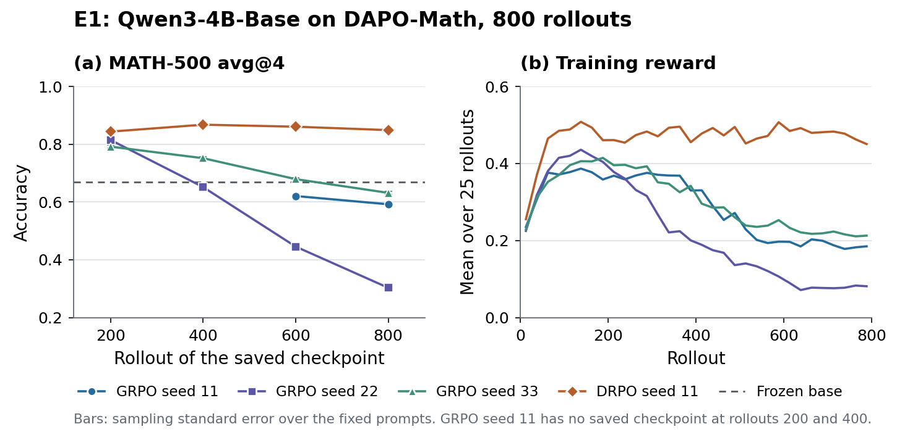
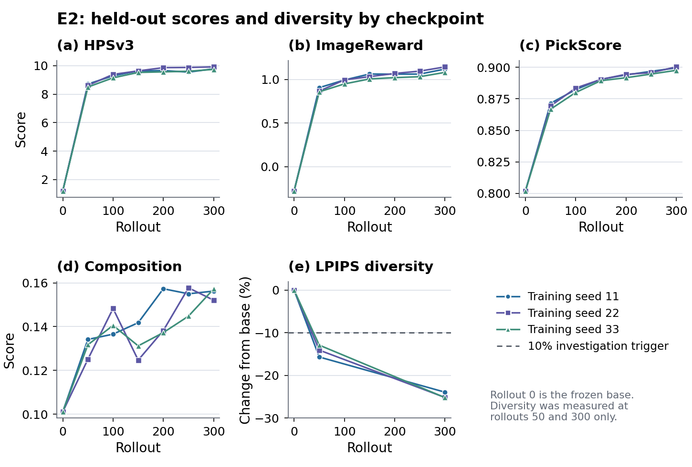

# E0, E1, E2 and E4 results from exported run data, 2026-10-08

This bundle holds data exported from the E0, E1, E2 and E4 runs, the generator
that turns it into the manuscript's tables, macros and figures, and the
generated files. It replaces the report-derived E1, E2 and E4 values in the
manuscript. The [2026-09-22 bundle](../2026-09-22/README.md) is unchanged and
remains the source for E3, E5-T and E6.

No measured value here was typed from a report: every one the manuscript quotes
for these four experiments is produced by `generate.py` from the files in
`data/`. What differs between parts is how far back that data goes, so each
part states its own tier. Two statements in the manuscript are not backed by
data in this bundle and are marked in the table: the E4 v2 recorded-rollout
check and the status lines of Appendix C. E4a's check count still comes from
the 2026-09-22 bundle.

## Evidence tier of each part

| Part | Data in this bundle | What is not here |
|---|---|---|
| E1 external evaluation | per-prompt accuracy for 17 evaluations on MATH-500, AIME 2024 and AIME 2025 (`e1_scores_*.csv`), copied from the benchmark outputs; all 51 files were complete with zero scoring errors | the completions themselves |
| E1 training series | per-rollout reward, zero-variance group ratio, truncation ratio, response length and rollout-replay parity for the four completed runs (`e1_rollouts.csv`), copied from each run's metrics file | the logs and the checkpoints |
| E1 repetition loops | loop counts per evaluation (`e1_evaluations.csv`), counted at export from the completions with the rule in `e1_runs.json` | the completions, so the counts cannot be regenerated here |
| E2 | per-seed, per-checkpoint means for four judges and the within-prompt LPIPS change at rollouts 50 and 300 (`e2_curves.json`), computed by the experiment from its per-image score files | the per-image scores and the images |
| E4 v2 quality comparison | the output of the pre-registered analysis, byte-identical (`e4v2_analysis_output.json`) | the per-image rows it was computed from |
| Earlier E4 run, cited in one sentence | the paired-analysis output (`e4_paired_analysis.json`) and per-run trajectories (`e4_trajectories.json`) | the per-image rows; the account of its defects comes from the experiment's record |
| E4 v2 recorded-rollout check | none | the check's outputs; the manuscript attributes this statement to the experiment's execution record |
| E0 parity on smoke runs | the 15 raw gauge rows (`e0_parity.json`) | the run logs |
| Status of the six checks in Appendix C | none beyond the parity rows | the statements summarize the E0 and E4 records |

Images, completions, logs and checkpoints stay on the experiment storage. The
run-directory contract in the manuscript's artifact appendix is therefore not
met by this bundle.

## Run identity

**E1.** Qwen3-4B-Base on DAPO-Math-17k, 800 rollouts of 64 prompts with eight
samples, four optimizer updates per rollout, on four nodes of eight NVIDIA H20
96 GB GPUs. All four runs used source commit
[`2055f2a2`](https://github.com/celve/unirl-pub/commit/2055f2a23353ead1ea3302741ff9378c7e62da6a).
`e1_runs.json` lists the recipes, seeds, overrides, data hashes, evaluated
checkpoints and the evaluation decoding.

- GRPO seeds 11, 22 and 33 use the prespecified recipe. Seed 11 was resumed
  from its rollout-200 checkpoint; its checkpoints 200 and 400 were lost from
  shared storage before the external evaluation.
- DRPO seed 11 was added after GRPO seed 11 finished. It is a departure from
  the prespecified protocol. Its recipe was run with
  `rl_on_policy_target=null`; as committed, that setting gives every group zero
  variance and a zero gradient.
- DRPO seed 22 stopped at rollout 369 of 800 when its allocation ended, and
  DRPO seed 33 has not started. Neither is included.
- The seed ID controls data order only. Generation sampling is not seeded, and
  the text benchmarks are not seeded, which is why the final checkpoints of
  both seed-11 runs were evaluated twice.

**E2.** SD3.5-Medium FlowGRPO, seeds 11, 22 and 33, 300 rollouts each on one
node of eight H20 GPUs, at source commit
[`caabdfcf`](https://github.com/celve/unirl-pub/commit/caabdfcf50850add5217ab6b0fbd3df0001a4e8b).
Evaluation uses 512 x 512, 40 steps, guidance 1 and evaluation seed 42. The
preference rows have 1,632 prompts with 16 images each, the composition rows
800 prompts with one image each, and the diversity guard 120 image pairs per
prompt.

**E4, earlier run.** Six runs at training commit
[`fa095260`](https://github.com/celve/unirl-pub/commit/fa0952602956e435e909a436540098a405cb5f3e),
evaluated at
[`698eaa0f`](https://github.com/celve/unirl-pub/commit/698eaa0f9e33258edd6405fbfcffaa154f40255c),
one node of eight H20 GPUs per run.

**E4 v2.** Six runs at commit `0e538fcf956fa93d89d7f2623550f1b9c6e27803`. This
commit is not yet on a public branch. The analysis was registered before the
runs started; `e4v2_analysis_output.json` has SHA-256
`c59ccbc36814f154...`, the value the experiment recorded for its output.

**E0.** Each smoke run started from a clean tree at one of the commits listed
in `e0_parity.json`. All are ancestors of
[`a7352497`](https://github.com/celve/unirl-pub/commit/a7352497112868913232a9d66cba04a13ef6f7cd).
The E0 instrumentation is not part of the upstream UniRL repository.

## Files

- `data/`: the exported inputs described above. `e2_curves.json` and
  `e4_trajectories.json` are trimmed copies of the experiments' own files, with
  storage locations and unused series removed; each records the SHA-256 of the
  file it was cut from.
- `generate.py`: reads `data/` and writes everything below. It asserts the
  statements the manuscript makes in words, for example that every GRPO seed
  ends below the base and that no E4 v2 run collapsed, so a data change that
  breaks one of them fails the generator.
- `macros.tex`: numerical commands used by the manuscript prose. Their names do
  not overlap with the 2026-09-22 macros, and the generator checks this.
- `e1_table.tex`, `e2_table.tex`, `e4_table.tex`: table bodies for RQ1 and RQ3.
- `e0_parity_table.tex`, `e1_parity_table.tex`: table bodies for Appendix C.
- `figures/e1_endpoint.pdf`, `figures/e2_curves.pdf`: manuscript figures, with
  PNG previews.
- `manifest.json`, `checksums.sha256`: hashes of this bundle. They validate the
  bundle, not the experiment storage it was exported from.

`main.tex` owns the floats, captions and labels. The table snippets require
`tabularx` and `booktabs`. Overleaf needs no Python: the TeX and PDF files are
committed.

## Interpretation boundaries

**E1.** MATH-500 avg@4 at rollout 800 is the registered endpoint. The `±` in
the table is the sampling standard error over the fixed prompts, which
separates two evaluations of one checkpoint and says nothing about the next
training seed. The seed-level interval for the GRPO change from base has two
degrees of freedom. The rollout-200 values are not the endpoint. DRPO has one
seed and a recipe that differs from GRPO's in five settings, so the bundle
supports no comparison of the two objectives. No reference implementation was
run. Internal AIME, the validation instrument evaluated every ten rollouts
under a fixed 8,192-token limit, is deliberately not exported.

**E2.** HPSv3 at checkpoint 300 is the registered primary endpoint. Intervals
are 95% t intervals over three seeds. The composition row is UniRL's synthetic
compositional set with a Soft-TIFA-style scorer, not official GenEval 2. The
LPIPS row is a relative change in within-prompt diversity, measured at
rollouts 50 and 300 only; its level at rollout 300 is not stored and is not
reconstructed. The preference rows use 16 images per prompt where the
manuscript originally specified one. Image seeds do not depend on the sample
count, so the one-image endpoint is the first-sample subset of the same rows;
that subset has not been scored separately. The reference arm E2-R has no
held-out evaluation and is not in this bundle.

**E4 v2 and the earlier E4 run.** The contrast is root scope minus rewrite
scope on root-conditioned HPSv3 at checkpoint 300, one value per training-seed
pair. E4 v2 is the result the manuscript reports. It is inconclusive at three
pairs and is not evidence that the two groupings are equivalent. The earlier
run used a rewriter recipe without its instruction and extraction marker, two
of its six runs ended below the untrained base, and its two scopes trained on
different rewrites. It was also inconclusive. The manuscript cites it in one
sentence with its interval, and its data stay here so that sentence can be
regenerated. The two runs use different held-out rewrite manifests, so their
magnitudes are not comparable.

**E0.** Each parity cell is one check on a smoke run. The gauge ran with a
tolerance of 10.0, chosen so that it records and never stops a run. No
acceptance tolerance has been set for any path, so these rows are magnitudes
and not a pass. The per-rollout parity in `e1_rollouts.csv` comes from the
formal E1 runs with the tolerance unset.

## Known gaps

- The E4 v2 commit is not public, and the outputs of its recorded-rollout check
  are not in the bundle.
- The one-image E2 preference subset is not scored.
- Two of three DRPO seeds are missing.
- The shipped PickScore prompt splits share 32 test prompts with the training
  split after text normalization. The splits were kept as shipped.
- Reward-service GPU-hours for E2 and E4 were not recorded separately from each
  other.

## Regeneration

From the repository root, with the dependencies in
`experiments/reported_results/requirements.txt`:

```sh
python3 artifacts/reported_results/2026-10-08-e0-e1-e2-e4/generate.py
python3 artifacts/reported_results/2026-10-08-e0-e1-e2-e4/generate.py --check
```

Validated with Python 3.9.6, Matplotlib 3.9.4 and NumPy 2.0.2, the versions the
2026-09-22 bundle records. Repeated generation there produces byte-identical
tables and figures. Other renderer versions can change the figure bytes without
changing the data.




